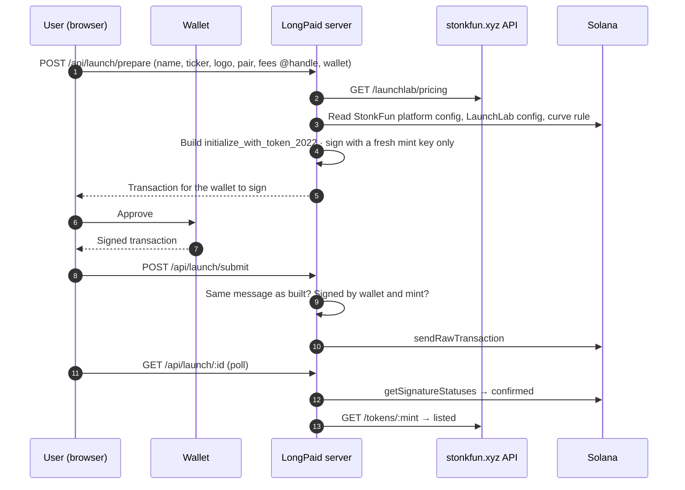
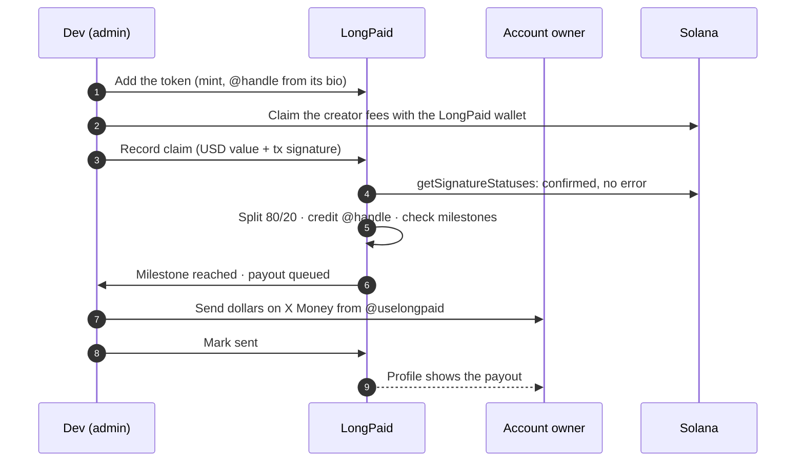
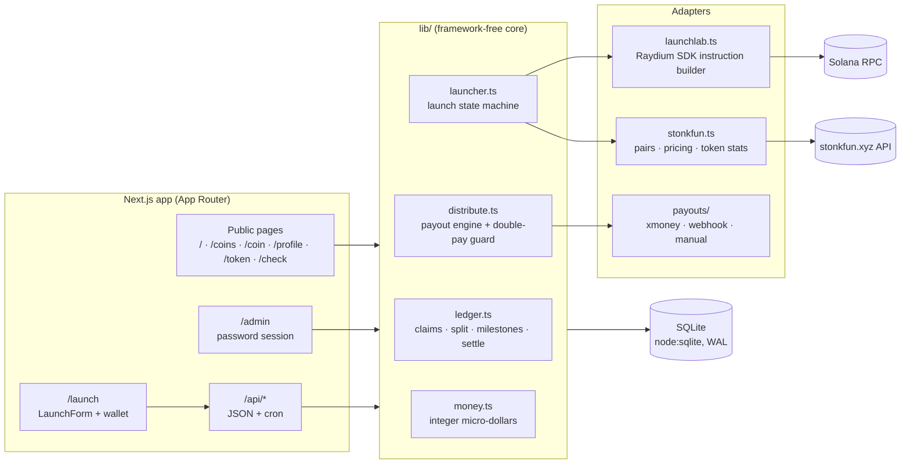

<p align="center">
  
</p>

<h1 align="center">LongPaid</h1>

<p align="center">
  A launchpad for <a href="https://www.stonkfun.xyz">stonkfun.xyz</a> coins on Solana, and a public ledger that routes creator fees to any X account, paid out through X Money.
</p>

<p align="center">
  <a href="https://github.com/uselongpaid/uselongpaid/actions/workflows/ci.yml"></a>
  
  
  
  
  
</p>

---

LongPaid does two things:

1. **Launch.** Anyone can launch a stonkfun.xyz coin from `/launch`. The site builds a Raydium LaunchLab launch under
   StonkFun's platform config, the user's wallet signs it, and stonkfun.xyz adopts the pool within a minute or two. Every
   coin launched here is listed on `/coins` and gets its own page at `/coin/:mint`.
2. **Pay X accounts.** For tokens whose creator fees reach LongPaid's wallet, the team claims the fees and records each claim.
   From then on everything is automatic:
   - **80%** is credited to the X account named in the bio (`fees @handle`), **20%** is set aside to buy back and burn.
   - Every time the account's lifetime earnings cross a milestone (**$5, $10, $20, $50, $100, $250, $500, $1,000**, then
     every **$1,000**) its full unpaid balance is queued for payout.
   - Payouts are sent in dollars **through X Money, straight to the @handle**. The recipient doesn't sign up or connect
     anything.

> LongPaid is an independent project. It is not affiliated with stonkfun.xyz, Raydium, X, or UsePaid.

## Contents

- [Launching a coin](#launching-a-coin)
- [Coin pages and the launchpad](#coin-pages-and-the-launchpad)
- [Paying X accounts](#paying-x-accounts)
- [Features](#features)
- [Architecture](#architecture)
- [The money flow in detail](#the-money-flow-in-detail)
- [Payout safety](#payout-safety)
- [Data model](#data-model)
- [Running it](#running-it)
- [Operating it](#operating-it)
- [Configuration](#configuration)
- [HTTP API](#http-api)
- [Project structure](#project-structure)
- [Testing](#testing)
- [Security](#security)
- [Roadmap](#roadmap)

## Launching a coin

stonkfun.xyz coins run on **Raydium LaunchLab**: a bonding curve first, then a Raydium CPMM pool once the curve fills.
stonkfun's own launch endpoint is off; its Developer API says to build LaunchLab's `initialize_with_token_2022` against a
StonkFun platform config, and stonkfun adopts every pool carrying its platform id. That is what
[`lib/launchlab.ts`](lib/launchlab.ts) does. It is **non-custodial**: the server never holds a user key or funds.



1. The browser connects **Phantom, Solflare or Backpack** and posts the form. With a handle, the bio ends with
   `fees @handle`.
2. The server reads what StonkFun's platform allows **from chain**: its platform config
   (`4E876qZTE9FJMrBzgVtBrSrzz2TLivB5Y5QXPjB4gZL7`, the standard launch without a transfer fee), LaunchLab's global config
   for the chosen pair, and the platform's curve-rule account. Supply, amount sold on the curve and raise target are picked
   to satisfy that rule (stonkfun's `/launchlab/pricing` numbers are used where the rule allows a range). A wrong value
   fails the transaction on chain instead of launching something odd.
3. The wallet is **payer and creator**. The transaction comes back signed only by a fresh mint key, which has no authority
   once the pool exists and is thrown away.
4. `POST /api/launch/submit` relays it only if its message is **byte-for-byte the one that was built** and it carries the
   wallet's and the mint's signatures.
5. The page polls until the transaction is confirmed and stonkfun lists the coin.

The user pays the network and account costs of the launch; LongPaid adds nothing. As the pool creator, the launching wallet
receives the coin's creator fees. Set `LAUNCH_ON_SITE=0` to hide the form.

## Coin pages and the launchpad

- **`/coins`** lists every coin launched from this site, newest first, searchable by name, ticker, `@handle` or mint. The
  home page shows the newest six.
- **`/coin/:mint`** shows the logo, name, ticker and mint (copy button); trade links (stonkfun.xyz, Jupiter, explorer, the
  coin's X/website/Telegram, share on X); the `fees @handle` line; market cap, price, 24h volume, holders and
  bonding-curve progress from stonkfun's `GET /tokens/:mint` (cached 30 s); a DEX Screener chart; the bio; and on-chain
  details (mint, pool, creator, launch transaction).
- **Metadata.** The mint's URI points at `/api/launch/:id/metadata` on this site; uploaded logos are served from
  `/api/launch/:id/image`. Unless the creator gave a website, the metadata's `website` is the coin's page here, so wallets
  and explorers link back to LongPaid. Keep the site on a stable domain.
- Launches whose page was closed before they confirmed are settled when `/coins` or the coin page is opened. Looking up a
  coin's mint in the search box opens its page.

## Paying X accounts



Claims are **manual by design**: the dev claims and records the result. Every step after that (the split, milestone
tracking and queueing) runs without anyone touching it.

X Money has no public API, so payouts are sent from LongPaid's pre-funded X Money balance:

1. `/admin` → **Send on X Money** lists each queued payout with the @handle and amount ready to copy.
2. The operator sends it in the X app (Wallet → Send) and clicks **Sent**.
3. If an account can't receive X Money yet, **Can't pay** returns the amount to its balance; it goes out with the next
   milestone.

`PAYOUT_PROVIDER=webhook` hands payouts to your own payout service instead (see [HTTP API](#http-api)).

## Features

| | |
| --- | --- |
| **Launch form** | `/launch`: connect a Solana wallet, fill in name, ticker, logo, pair, description, `fees @handle` and links, approve. |
| **Launchpad** | `/coins`: every coin launched here, searchable. Newest six on the home page. |
| **Coin pages** | `/coin/:mint`: market data, chart, trade and share links, bio and on-chain details. |
| **Public ledger** | Live totals (refresh every 15 s), fees-per-day chart, recent claims, top tokens, leaderboard, fee-flow diagram. |
| **Profiles** | `/profile/:handle`: X avatar, lifetime earnings, paid out, balance, distance to next milestone, earnings per token, payouts and claims. |
| **Token pages** | `/token/:address`: fees claimed, amount sent to the account, amount burned, every claim. |
| **Checker** | `/check`: is a token set up, which handle it pays, how much it has earned. |
| **Admin** | `/admin`: add tokens, record claims (signature checked on chain), the X Money send queue, settle or retry payouts, record buyback-and-burn transactions, manage opt-outs. |
| **Automatic distribution** | Runs after every recorded claim and from cron. |

## Architecture



- **The core in `lib/` doesn't depend on Next.js.** The same code runs in the web app, the CLI scripts and the tests.
- **Adapters are interfaces.** The launcher takes its builder, stonkfun client and Solana RPC as dependencies, and
  `PayoutProvider` decides how money leaves, so each can be swapped or faked in tests.
- **Money is integer micro-dollars** (`1 USD = 1_000_000`) everywhere, so there's no floating-point drift.
- **Solana addresses stay case-sensitive.** Mints and signatures are base58 and stored exactly as given
  ([`lib/address.ts`](lib/address.ts)).
- **SQLite with WAL** keeps deployment to one process and one file. Every ledger change runs in a transaction.

## The money flow in detail

### 1. Recording a claim: `recordClaim()` in [`lib/ledger.ts`](lib/ledger.ts)

In one database transaction:

1. Rejects the claim if the amount isn't positive or its **transaction signature was already recorded** (there's also a
   unique index).
2. Splits the amount: `recipient = floor(amount × 8000 / 10000)`, `burn = amount − recipient`. Rounding dust goes to the
   burn. If the account **opted out**, the whole claim goes to the burn.
3. Adds the recipient share to the account's `balance` and `lifetime` totals, and records the burn as `pending`.
4. Checks milestones (below). If one was crossed, moves the **entire balance** into a new `queued` payout and zeroes the
   balance, so the same money can never be queued twice.

Before calling it, `/admin` checks the signature on Solana (`getSignatureStatuses`) and refuses ones that don't exist or
failed.

### 2. Milestones: [`lib/milestones.ts`](lib/milestones.ts)

Each account stores the highest milestone it has already crossed. A claim that jumps several milestones at once (say from
$9 to $109, crossing $10, $20, $50 and $100) produces **one** payout, and the next one is due at $250.

### 3. Distribution: `distributePending()` in [`lib/distribute.ts`](lib/distribute.ts)

For every `queued` payout:

| Provider answer | Result |
| --- | --- |
| `null` | Stays queued (for X Money: waiting for the operator to send it). |
| `{ ok: true, ref }` | Marked `paid`; added to the account's `paid` total. |
| `{ ok: false, reason }` | Marked `failed`; the amount returns to the balance and goes out with the next milestone. |
| throws | See [Payout safety](#payout-safety). |

It runs after every recorded claim, from `POST /api/cron/distribute` or `npm run distribute`, and from **Distribute now**
in `/admin`.

### 4. Buyback and burn

Burn shares add up as `pending` rows. The admin buys back and burns the token, then records that transaction in `/admin`,
which marks all pending burns done. The total owed is always shown on the dashboard.

## Payout safety

A payout can fail in an ambiguous way: handed to the provider, but the process crashed before the answer came back.
LongPaid never guesses in that case.

1. Before handing a payout to the provider, the engine sets `attempted_at` with a conditional update, so two runs can't take
   the same payout.
2. Any reference the provider returns while the payout is in flight is stored in `attempt_ref`.
3. If it fails after that point, the payout stays marked and is shown in `/admin` as **check on chain**. An admin either
   marks it paid, or clicks **Not sent, retry**. It is never re-sent automatically.
4. Providers that dedupe on their own side (`webhook`, keyed on `idempotencyKey`) and the X Money queue declare
   `retrySafe = true`.

## Data model

| Table | Purpose |
| --- | --- |
| `site_launches` | Coins launched from `/launch`: wallet, handle, name, symbol, bio, logo, links, pair, mint, pool, built transaction, `building` → `prepared` → `submitted` → `completed` / `failed`, launch signature, `listed`. |
| `tokens` | Tokens on the fee ledger: mint, name, symbol, X handle, total fees. |
| `accounts` | One row per X handle: `balance`, `lifetime`, `paid`, `milestone`, `opted_out`. |
| `claims` | Every recorded claim: amount, recipient/burn split, unique transaction signature, note. |
| `payouts` | `queued` → `paid` / `failed`, with `provider_ref`, `attempted_at` and `attempt_ref` for in-flight tracking. |
| `burns` | Burn shares: `pending` → `done` with the burn transaction. |
| `kv` | Small key-value store. |

The ledger always balances, and the tests check it:
`Σ claims = Σ recipient + Σ burn` and `Σ recipient = Σ balances + Σ queued and paid payouts`. A failed payout's amount goes
back into the balance.

The schema is created and migrated automatically on start (additive changes, no manual steps).

## Running it

Requires **Node.js 22.13+** (for the built-in `node:sqlite`).

```bash
git clone https://github.com/uselongpaid/uselongpaid.git
cd uselongpaid
npm install
cp .env.example .env.local     # fill in the values, see Configuration
npm run dev                    # http://localhost:3000
```

Production:

```bash
npm run build
npm start
```

Deploy it as **one long-running Node process with a persistent disk** for `DATABASE_PATH`: a VPS, Fly.io, Railway or Render
with a volume. Serverless platforms with ephemeral filesystems will lose the database, including every launched coin's
metadata. Back up the SQLite file regularly, for example with `sqlite3 longpaid.db ".backup backup.db"` from cron.

**Railway:** Railway's default Node build works as is (`npm ci`, `npm run build`, `npm start`). `railway.json` only adds a
health check on `/api/version`, and `.nvmrc` pins Node 22. Don't set a custom build command that runs `npm ci` again: it
collides with Railway's build cache (`EBUSY … node_modules/.cache`). Add a **Volume** mounted at `/data` and set
`DATABASE_PATH=/data/longpaid.db`, or the database is wiped on every deploy. After a deploy, open `/api/version`: `commit`
must match the latest commit on `main`.

Schedule distribution:

```cron
*/10 * * * * curl -fsS -X POST -H "Authorization: Bearer $CRON_SECRET" https://your-domain/api/cron/distribute
```

## Operating it

**Setting up**

1. Set `APP_URL` to the public domain, `SOLANA_RPC_URL` to a dedicated RPC (Helius, Triton, QuickNode…), and
   `LONGPAID_X_HANDLE` / `LONGPAID_FEE_WALLET` to LongPaid's X account and Solana wallet.
2. Open `/launch` and check the pair list loads (that confirms the stonkfun API is reachable). Do one small test launch.

**Adding a token to the fee ledger**

When a token's creator fees reach `LONGPAID_FEE_WALLET`, add it in `/admin` → **Add or update a token** with its mint
address, the handle from its bio, name and symbol.

**Recording a claim**

1. Claim the token's creator fees with the LongPaid wallet.
2. In `/admin` → **Record a claim**, pick the token, enter the USD value you received and the claim transaction signature.
   Optionally add a note, for example `1.25 SOL @ $180`.
3. Submit. The result shows the split, whether a milestone was hit, and what is ready to send.

**Sending payouts**

- `/admin` → **Send on X Money**: send each payout from @uselongpaid's X Money balance, then click **Sent**. Keep the balance
  topped up from claimed fees.

**Buyback and burn**

- When **Burn owed** is worth it, buy back and burn, then paste the transaction signature into **Buyback and burn**.

## Configuration

All settings are environment variables. [`.env.example`](.env.example) lists every one with comments.

| Variable | Required | Description |
| --- | --- | --- |
| `APP_URL` | yes | Public URL. Used for same-origin checks and links. |
| `SESSION_SECRET` | yes | Signs session cookies. `openssl rand -hex 32` |
| `ADMIN_PASSWORD` | yes | Password for `/admin`. |
| `CRON_SECRET` | yes | Bearer token for `/api/cron/*` and the JSON admin API. |
| `DATABASE_PATH` | | SQLite file. Default `./data/longpaid.db`. |
| `SOLANA_RPC_URL` | | Builds launches, sends them, and checks claim and burn signatures. Default `https://api.mainnet-beta.solana.com`; use a dedicated RPC in production. |
| `LAUNCH_ON_SITE` | | `0` hides the launch form. Default on. |
| `STONKFUN_API_URL` | | stonkfun's public API. Default `https://www.stonkfun.xyz/api/public/v1`. |
| `LAUNCHPAD_NAME`, `LAUNCHPAD_URL`, `LAUNCHPAD_LAUNCH_URL` | | Default `stonkfun.xyz`, `https://www.stonkfun.xyz`, `https://www.stonkfun.xyz/launch`. |
| `LAUNCHPAD_TOKEN_URL` | | A coin's page on stonkfun, `{mint}` replaced. Default `https://www.stonkfun.xyz/token/{mint}`. |
| `NEXT_PUBLIC_CHAIN_NAME`, `NEXT_PUBLIC_EXPLORER_URL` | | Default `Solana` and `https://solscan.io`. Set at build time. |
| `EXPLORER_TX_URL` | | Transaction links in `/admin`. Default `$NEXT_PUBLIC_EXPLORER_URL/tx/{hash}`. |
| `LONGPAID_X_HANDLE` | yes | LongPaid's X account. X Money payouts are sent from it. |
| `LONGPAID_FEE_WALLET` | | LongPaid's Solana wallet for creator fees routed to the ledger. Shown on `/launch` and `/docs`. |
| `RECIPIENT_SHARE_BPS` | | Account share in basis points. Default `8000` (80%). |
| `PAYOUT_MILESTONES_USD`, `PAYOUT_MILESTONE_STEP_USD` | | Milestone schedule. Default `5,10,20,50,100,250,500,1000` and `1000`. |
| `PAYOUT_PROVIDER` | | `xmoney` (default), `webhook` or `manual`. |
| `PAYOUT_WEBHOOK_URL`, `PAYOUT_WEBHOOK_SECRET` | webhook | Your payout service and HMAC secret. |

## HTTP API

Public, read-only:

```http
GET  /api/stats                         totals: claimed, paid, burned, tokens, accounts
GET  /api/tokens?sort=fees|new&q=&limit= tokens on the fee ledger
GET  /api/profile/:handle               account, tokens, payouts, claims
GET  /api/launch/pairs                  pairs a new coin can trade against (from stonkfun)
GET  /api/launch/:id/metadata           a launched coin's token metadata
GET  /api/launch/:id/image              a launched coin's uploaded logo
```

Launching (same-origin, used by the launch form):

```http
POST /api/launch/prepare                form + wallet → transaction for the wallet to sign
POST /api/launch/submit                 {"id": "…", "signedTransaction": "<base64>"}
GET  /api/launch/:id                    status: submitted → completed, listed
```

Operator (`Authorization: Bearer $CRON_SECRET`):

```http
POST /api/cron/distribute               queue and hand out payouts → DistributionReport
GET  /api/admin/payouts?status=queued   list payouts
POST /api/admin/payouts                 {"id": 1, "ok": true, "ref": "X Money"} settle by hand
POST /api/admin/opt-out                 {"handle": "alice", "optedOut": true}
```

Webhook payout contract (`PAYOUT_PROVIDER=webhook`), in [`lib/payouts/webhook.ts`](lib/payouts/webhook.ts):

```http
POST $PAYOUT_WEBHOOK_URL
x-longpaid-timestamp: 1790000000000
x-longpaid-signature: sha256=<hex HMAC-SHA256 of "<timestamp>.<body>">

{"id": 12, "idempotencyKey": "payout-12", "handle": "alice", "wallet": null,
 "amountMicros": 8000000, "amountUsd": "8.00", "currency": "USD"}
```

Reply `200 {"status":"sent","ref":"…"}` or `200 {"status":"failed","reason":"…"}`. A `5xx` reply or a timeout is retried
with the same `idempotencyKey`, so your service must never pay the same key twice.

## Project structure

```
app/
  page.tsx                 home: hero, live totals, new launches, how it works, fee flow, claims, FAQ
  launch/                  launch form + guide
  coins/ · coin/[mint]/    launchpad list and coin pages
  profile/ · token/ · check/ · leaderboard/ · docs/
  admin/                   dashboard, claims, X Money queue, burns, opt-outs
  api/launch/              pairs, prepare, submit, status, metadata, image
  api/                     stats, tokens, profile, cron, admin
components/
  LaunchForm.tsx           wallet connect, form, sign, status
  CoinCard.tsx · FeeFlow.tsx · LiveStats.tsx · FeesChart.tsx · …
lib/
  launchlab.ts             LaunchLab initialize_with_token_2022 under StonkFun's platform, curve rule → parameters
  launcher.ts              launch state machine: build, verify, relay, confirm, listed
  stonkfun.ts              stonkfun API: pairs, pricing, token stats, listing
  solana/tx.ts             transaction decoding and signature checks
  coins.ts · market.ts     launchpad queries, cached market data
  ledger.ts · distribute.ts · milestones.ts · money.ts
  payouts/                 xmoney · webhook · manual
  address.ts · handle.ts · auth.ts · session.ts · db.ts · config.ts
scripts/                   distribute.ts
tests/                     node:test suites
```

## Testing

```bash
npm test            # unit and integration tests (node:test, in-memory SQLite)
npm run typecheck   # tsc --noEmit, strict
npm run build       # production build
```

The suites cover the launch flow (form validation, building for the right wallet, relaying only the exact transaction,
expiry, failed and dropped launches, listing), choosing curve parameters from StonkFun's on-chain curve rule, the Raydium
LaunchLab instruction under StonkFun's platform, the stonkfun API client, Solana address and signature handling, the split
and rounding, milestone crossing, ledger balance invariants, duplicate-claim rejection, opt-out, the distribution engine,
the X Money queue, webhook signing, signed sessions and handle parsing. CI runs all three commands on every push and pull
request.

The full launch path (form → build → wallet signature → send → confirm → listed → coin page) has also been run in a
browser against a local Solana RPC and stonkfun API.

## Security

- **Non-custodial launches:** the user's wallet pays, signs and is the creator. The server holds no user key or funds, and
  only relays a transaction whose message is byte-for-byte the one it built, signed by that wallet.
- **Admin:** password login with a constant-time comparison and a delay on failures. The session cookie is HMAC-signed,
  `httpOnly` and `SameSite=Strict`, and expires after 12 hours.
- **Forms:** every state-changing request checks the `Origin` header against the request host or `APP_URL`. The launch
  endpoint is rate-limited per IP.
- **Integrity:** claim signatures are unique and verified on Solana. Ledger writes are transactional. Payouts can't be
  queued or sent twice (see [Payout safety](#payout-safety)).
- **Opt-out:** anyone can put any handle in a bio, so owners can refuse. Their share is then burned.

## Roadmap

- [ ] Route creator fees of coins launched here to the fee ledger automatically.
- [ ] Automated buyback-and-burn swap (currently recorded by hand).
- [ ] X Money payouts through an API, once X offers one (plugs in as a `PayoutProvider`).
- [ ] Optional dev buy in the launch transaction.
- [ ] Postgres adapter for multi-instance deployments.
