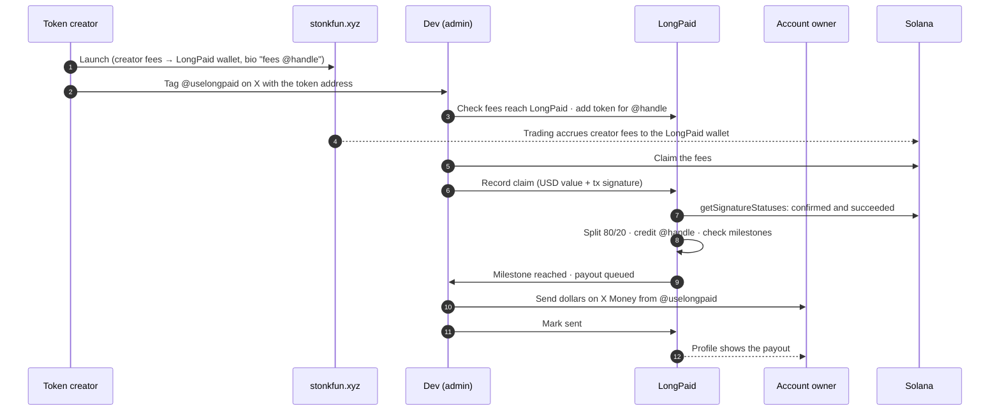
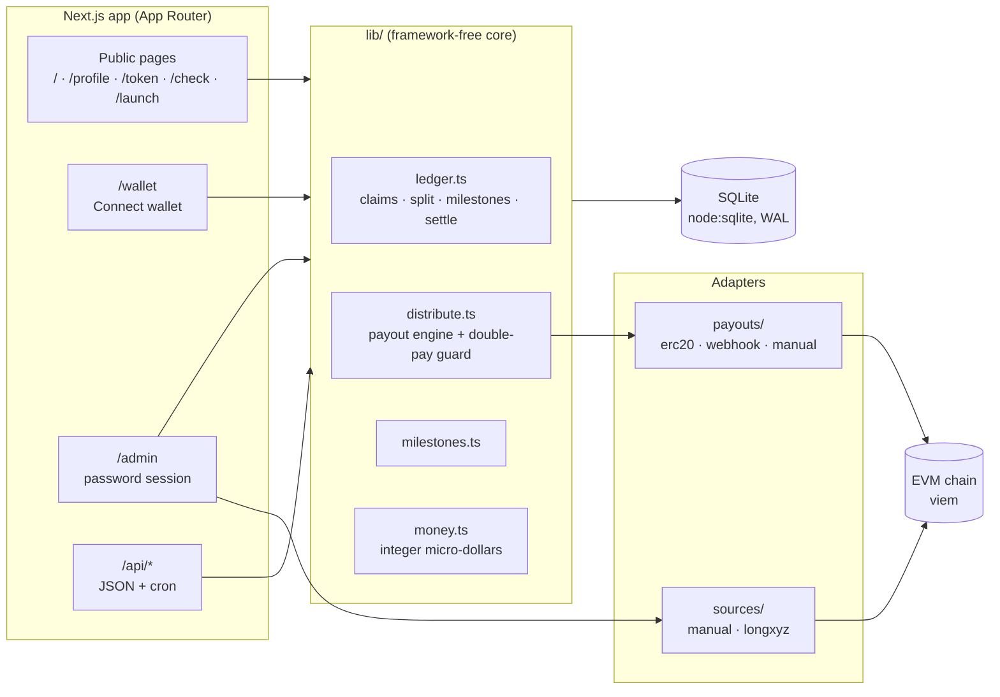

<p align="center">
  
</p>

<h1 align="center">LongPaid</h1>

<p align="center">
  Route the creator fees of <a href="https://www.stonkfun.xyz">stonkfun.xyz</a> tokens on Solana to any X account — split on a public ledger, paid out through X Money.
</p>

<p align="center">
  <a href="https://github.com/uselongpaid/uselongpaid/actions/workflows/ci.yml"></a>
  
  
  
  
</p>

---

A creator launches on **stonkfun.xyz** (Solana) as usual, sends the creator fees to **LongPaid's wallet**
(`LONGPAID_FEE_WALLET`) and writes **`fees @handle`** in the token bio, then tags **@uselongpaid** on X with the token
address. The team checks on-chain that the fees reach LongPaid and adds the token in `/admin`. The team claims the fees and
records each claim with its Solana transaction signature, which is checked on-chain. From that moment on, everything is
automatic:

- **80%** is credited to the X account, **20%** is set aside to buy back and burn.
- Every time the account's lifetime earnings cross a milestone — **$5, $10, $20, $50, $100, $250, $500, $1,000**, then every
  **$1,000** — its full unpaid balance is paid out.
- Payouts are sent in dollars **through X Money, straight to the @handle**, from LongPaid's pre-funded X Money balance. The
  recipient doesn't sign up or connect anything.

> LongPaid is an independent project. It is not affiliated with stonkfun.xyz, X, or UsePaid.

## Contents

- [How it works](#how-it-works)
- [Features](#features)
- [Architecture](#architecture)
- [The money flow in detail](#the-money-flow-in-detail)
- [Optional: detecting launches on app.long.xyz](#optional-detecting-launches-on-applongxyz)
- [Payout safety](#payout-safety)
- [Launching from the site](#launching-from-the-site)
- [X Money payouts](#x-money-payouts)
- [Linking a payout wallet (erc20 mode)](#linking-a-payout-wallet-erc20-mode)
- [Data model](#data-model)
- [Running it](#running-it)
- [Operating it](#operating-it)
- [Configuration](#configuration)
- [HTTP API](#http-api)
- [Project structure](#project-structure)
- [Testing](#testing)
- [Security](#security)
- [Roadmap](#roadmap)

## How it works



Claims are **manual by design**: the dev claims on stonkfun.xyz and records the result. Every step
after that — the split, milestone tracking, queueing and the on-chain payout — runs without anyone touching it.

## Features

| | |
| --- | --- |
| **Public site** | Live totals (refresh every 15 s), fees-per-day chart, recent claims, top tokens, leaderboard, lookup by handle or token address. |
| **Profiles** | `/profile/:handle` — X avatar, lifetime earnings, paid out, balance, distance to next milestone, earnings per token, payout and claim history. |
| **Token pages** | `/token/:address` — fees claimed, amount sent to the account, amount burned, every claim. |
| **Launch guide** | `/launch` — copy the treasury address, generate the metadata JSON and description line for a handle. |
| **Eligibility checker** | `/check` — reads the token from chain and shows whether it's registered and where its fees go. |
| **Connect wallet** | Header button for any EIP-1193 browser wallet (MetaMask, Rabby, …). Adds and switches to Robinhood Chain automatically. |
| **Payout wallet** | `/wallet` — link an X handle to the connected wallet (signature + X post), see earnings, paid out and waiting per handle, and request status. |
| **Admin** | `/admin` — register tokens (name and symbol read from chain), record claims with on-chain tx verification, watch the payout queue and payout wallet balance, settle or retry payouts, record buyback-and-burn transactions, manage opt-outs. |
| **Automatic distribution** | Runs after every recorded claim, when an owner links a wallet, and from cron. |
| **Pluggable payout rails** | `erc20` (on-chain stablecoin), `webhook` (HMAC-signed call to your own payout service), `manual`. |

## Architecture



- **The core in `lib/` doesn't depend on Next.js.** The same code runs in the web app, in the CLI scripts and in the tests.
- **Adapters are interfaces.** `FeeSource` decides where claims come from, `PayoutProvider` decides how money leaves.
  Adding a rail (for example X Money, once it has an API) is one class.
- **Money is integer micro-dollars** (`1 USD = 1_000_000`) everywhere, so there's no floating-point drift. On-chain amounts
  are converted with `bigint`.
- **SQLite with WAL** keeps deployment to one process and one file. Every ledger change runs in a transaction.

## The money flow in detail

### 1. Recording a claim — `recordClaim()` in [`lib/ledger.ts`](lib/ledger.ts)

In one database transaction:

1. Rejects the claim if the amount isn't positive or its **tx hash was already recorded** (there's also a unique index).
2. Splits the amount: `recipient = floor(amount × 8000 / 10000)`, `burn = amount − recipient`. Rounding dust goes to the burn.
   If the account **opted out**, the whole claim goes to the burn.
3. Adds the recipient share to the account's `balance` and `lifetime` totals, and records the burn as `pending`.
4. Checks milestones (below). If one was crossed, moves the **entire balance** into a new `queued` payout and zeroes the
   balance, so the same money can never be queued twice.

Before calling it, `/admin` checks the transaction receipt on-chain and refuses hashes that don't exist or failed.

### 2. Milestones — [`lib/milestones.ts`](lib/milestones.ts)

Each account stores the highest milestone it has already crossed. A claim that jumps several milestones at once
(say from $9 to $109, crossing $10, $20, $50 and $100) produces **one** payout, and the next one is due at $250.

### 3. Distribution — `distributePending()` in [`lib/distribute.ts`](lib/distribute.ts)

For every `queued` payout:

| Provider answer | Result |
| --- | --- |
| `null` (no wallet yet) | Stays queued, counted as *waiting*. Goes out automatically once a wallet is linked. |
| `{ ok: true, ref }` | Marked `paid` with the tx hash; added to the account's `paid` total. |
| `{ ok: false, reason }` | Marked `failed`; the amount returns to the balance and goes out with the next milestone. |
| throws | See [Payout safety](#payout-safety). |

It runs after every recorded claim, when an owner saves a wallet, from `POST /api/cron/distribute` or `npm run distribute`,
and from the **Distribute now** button in `/admin`.

### 4. Buyback and burn

Burn shares add up as `pending` rows. The admin buys back and burns the token, then records that transaction in `/admin`,
which marks all pending burns done. The total owed is always shown on the dashboard.

## Payout safety

Sending money on-chain can fail in an ambiguous way: the transaction was broadcast, but the process crashed or the RPC timed
out before the receipt came back. LongPaid never guesses in that case.

1. Before handing a payout to the provider, the engine sets `attempted_at` with a conditional update, so two runs can't take
   the same payout.
2. As soon as a transaction hash exists, `onBroadcast` stores it in `attempt_ref`.
3. The `erc20` provider **simulates the transfer first**. If the simulation fails (for example the payout wallet is short),
   nothing was sent: the marker is cleared and the payout is retried on the next run.
4. If it fails **after** broadcast, the payout stays marked and is shown in `/admin` as **check on chain**, with the tx hash.
   An admin either marks it paid, or clicks **Not sent, retry**. It is never re-sent automatically.
5. Providers that dedupe on their own side (`webhook`, keyed on `idempotencyKey`) declare `retrySafe = true` and are retried
   automatically.

## Optional: detecting launches on app.long.xyz

The original EVM integration is still in the code and off by default (set `LONGPAID_FEE_WALLETS` to turn it on).
LongPaid doesn't launch tokens itself: long.xyz's `LongLaunchFactory`
([`0x1Eef…2104`](https://robinhoodchain.blockscout.com/address/0x1Eef016F22A943abC7DD11422EDeE9D235942104)) only accepts
launches signed by long.xyz's backend. Creators launch on app.long.xyz, and LongPaid watches the factory
([`lib/long/sync.ts`](lib/long/sync.ts)):

1. Reads every `LaunchMetadata(asset, launcher, details)` event: token, name, symbol, `tokenURI`.
2. Decodes that launch's `launch(CreateParams, …)` calldata and checks that a LongPaid fee wallet (`LONGPAID_FEE_WALLETS`,
   the long.xyz wallet of `@LONGPAID_X_HANDLE`) is one of the fee beneficiaries in `poolInitializerData`, as a whole 32-byte
   word. **This is the only thing that makes a token count**; a bio can say anything.
3. Fetches the metadata (`ipfs://` through public gateways) and reads the handle from the bio: `fees @alice`,
   `fees to @alice`, `fee send @alice`, `fees: @alice` ([`feeHandleFromText`](lib/handle.ts)). LongPaid's own handle is
   ignored.
4. Both found → the token is registered for that handle. Routed but no handle (or metadata unreachable after 5 tries) →
   it waits in `/admin` → **Launches on app.long.xyz**, where the admin assigns a handle or dismisses it.

It runs every 2 minutes inside the web process (`instrumentation.ts`), from `POST /api/cron/sync-launches`,
`npm run sync-launches`, or **Sync now** in `/admin`. A cursor in the database resumes where it stopped, and log ranges the
RPC refuses are split in half until they fit.

## Launching from the site

`/launch` has a form that launches a stonkfun.xyz coin from this site. stonkfun's own launch endpoint is off; its
Developer API says to build Raydium LaunchLab's `initialize_with_token_2022` against a StonkFun platform config, and
stonkfun adopts every pool carrying its platform id within a minute or two. That is what
[`lib/launchlab.ts`](lib/launchlab.ts) does. It is non-custodial: the server never holds a user key or funds.

1. The browser connects Phantom, Solflare or Backpack and posts the form to `POST /api/launch/prepare`.
2. The server validates it (the bio gets `fees @handle` when a handle is given), asks stonkfun's
   `GET /launchlab/pricing` for its numbers, and reads from chain what StonkFun's platform allows: the platform config,
   LaunchLab's config for the chosen pair, and the platform's curve-rule account. It builds the launch with the wallet
   as payer and creator under StonkFun's standard platform (`4E876qZT…gZL7`), signed only by a fresh mint key.
3. The wallet signs. `POST /api/launch/submit` accepts it only if its message is byte-for-byte the one that was built,
   signed by that wallet and the mint, then sends it to Solana.
4. The page polls `GET /api/launch/:id` until the transaction is confirmed and stonkfun's `GET /tokens/{mint}` lists it.

The token's metadata is served by this site at `/api/launch/:id/metadata` (uploaded logos at `/api/launch/:id/image`),
so keep the site on a stable domain. The user pays the network and account costs; nothing is added. The launching
wallet is the pool creator, so its creator fees go to that wallet. To route fees to an X account through LongPaid's
80/20 split, launch with the fees going to `LONGPAID_FEE_WALLET` as described on the same page. Set `LAUNCH_ON_SITE=0`
to hide the form.

## X Money payouts

X Money has no public API, so LongPaid does what "paid through X Money from a pre-funded float" means in practice:

1. The money side is automatic: claims are split 80/20, milestones are tracked and a payout is queued the moment an
   account crosses one.
2. `/admin` → **Send on X Money** lists each queued payout with the @handle and amount ready to copy. The operator sends it
   from LongPaid's X Money balance in the X app (Wallet → Send) and clicks **Sent**.
3. If an account can't receive X Money yet, **Can't pay** returns the amount to its balance; it goes out with the next
   milestone.

Keep the X Money balance topped up from claimed fees. `PAYOUT_PROVIDER=erc20` (stablecoin to a linked wallet, fully
automatic) and `webhook` (your own payout service) remain available.

## Linking a payout wallet (erc20 mode)

Anyone can put any @handle in token metadata, so the owner of that handle has to prove it before money moves. There's no
X login. The flow uses a wallet signature plus a public post:

1. **Connect wallet** on `/wallet`. The site asks the wallet to add or switch to Robinhood Chain.
2. **Sign** a message naming the handle, the wallet, the chain ID and a timestamp. This is free and sends no transaction.
3. **Post** the code shown (`LP-XXXXXXXX`, derived from the signature) from that X account, then paste the post's link.
4. The server **verifies the signature** (`POST /api/wallet/link`) and stores a pending request.
5. An admin opens the post, confirms the **author** is that handle and the code matches, then approves in `/admin`.
   Approving sets the wallet, rejects competing requests for the handle, and immediately sends anything that was waiting.

Changing wallets works the same way. The admin sees the wallet being replaced before approving.

## Data model

| Table | Purpose |
| --- | --- |
| `tokens` | Registered tokens: address, name, symbol, X handle, total fees. |
| `accounts` | One row per X handle: `balance`, `lifetime`, `paid`, `milestone`, linked `wallet`, `opted_out`. |
| `claims` | Every recorded claim: amount, recipient/burn split, unique `tx_hash`, note. |
| `payouts` | `queued` → `paid` / `failed`, with `provider_ref`, `attempted_at` and `attempt_ref` for in-flight tracking. |
| `burns` | Burn shares: `pending` → `done` with the burn tx hash. |
| `detected_launches` | long.xyz launches routed to a LongPaid wallet: token, launch tx, fee wallet, handle, `pending` → `registered` / `needs_handle` / `dismissed`. |
| `wallet_links` | Wallet-link requests: handle, wallet, signed message, signature, code, post URL, `pending` → `approved` / `rejected`. |
| `kv` | Small key-value store (sync cursors for automatic mode). |

The ledger always balances, and the tests check it:
`Σ claims = Σ recipient + Σ burn` and `Σ recipient = Σ balances + Σ queued and paid payouts`. A failed payout's amount goes
back into the balance.

The schema is created and migrated automatically on start (additive `ALTER TABLE`s, no manual steps).

## Running it

Requires **Node.js 22.13+** (for the built-in `node:sqlite`).

```bash
git clone https://github.com/uselongpaid/uselongpaid.git
cd uselongpaid
npm install
cp .env.example .env.local     # fill in the values, see Configuration
npm run dev                    # http://localhost:3000
```

Production:

```bash
npm run build
npm start
```

Deploy it as **one long-running Node process with a persistent disk** for `DATABASE_PATH`: a VPS, Fly.io, Railway or Render
with a volume. Serverless platforms with ephemeral filesystems will lose the database. Back up the SQLite file regularly,
for example with `sqlite3 longpaid.db ".backup backup.db"` from cron.

**Railway:** Railway's default Node build works as is (`npm ci`, `npm run build`, `npm start`). `railway.json` only adds
a health check on `/api/version`, and `.nvmrc` pins Node 22. Don't set a custom build command that runs `npm ci` again:
it collides with Railway's build cache (`EBUSY … node_modules/.cache`). Add a **Volume** mounted at `/data` and set `DATABASE_PATH=/data/longpaid.db`,
or the database is wiped on every deploy. After a deploy, open `/api/version`: `commit` must match the latest commit on
`main`.

Schedule distribution so late wallet links and payouts that waited on a top-up go out on their own:

```cron
*/10 * * * * curl -fsS -X POST -H "Authorization: Bearer $CRON_SECRET" https://your-domain/api/cron/distribute
```

## Operating it

**Setting up**

1. Set `LONGPAID_FEE_WALLET` to LongPaid's Solana wallet and `LONGPAID_X_HANDLE` to its X account. `/launch` shows the
   wallet with a copy button.
2. Do one test launch on stonkfun.xyz with the creator fees going to that wallet and bio `fees @yourhandle`.

**Onboarding a token**

When a creator tags `@LONGPAID_X_HANDLE` with a token address, open it on Solscan and check that its creator fees go to
`LONGPAID_FEE_WALLET`. Then add it in `/admin` → **Add or update a token** with its mint address, handle, name and symbol.

**Recording a claim**

1. Claim the token's creator fees on stonkfun.xyz with the LongPaid wallet.
2. In `/admin` → **Record a claim**, pick the token, enter the USD value you received and the claim tx signature. Optionally
   add a note, for example `1.25 SOL @ $180`.
3. Submit. The result message shows the split, whether a milestone was hit, and what was paid out.

**Approving wallet links**

- In `/admin` → **Wallet link requests**, open each post. Approve only if the author is that handle and the code matches.

**Keeping payouts flowing**

- Keep the payout wallet funded with the stablecoin plus gas. Its balance is shown at the top of `/admin`.
- Anything marked **check on chain**: open the tx link. If it succeeded, mark it paid. If it doesn't exist, click
  **Not sent, retry**.

**Buyback and burn**

- When **Burn owed** is worth it, buy back and burn, then paste the tx into **Buyback and burn**.

## Configuration

All settings are environment variables. [`.env.example`](.env.example) lists every one with comments.

| Variable | Required | Description |
| --- | --- | --- |
| `SESSION_SECRET` | yes | Signs session cookies. `openssl rand -hex 32` |
| `ADMIN_PASSWORD` | yes | Password for `/admin`. |
| `CRON_SECRET` | yes | Bearer token for `/api/cron/*` and the JSON admin API. |
| `APP_URL` | yes | Public URL. Used for same-origin checks. |
| `LAUNCHPAD_NAME`, `LAUNCHPAD_URL`, `LAUNCHPAD_LAUNCH_URL` | | Where tokens launch. Default `stonkfun.xyz`, `https://www.stonkfun.xyz`, `https://www.stonkfun.xyz/launch`. |
| `LONGPAID_FEE_WALLET` | yes | LongPaid's Solana wallet that receives the creator fees. Shown on `/launch`. |
| `SOLANA_RPC_URL` | | Confirms claim and burn signatures and that a mint exists. Default `https://api.mainnet-beta.solana.com`. |
| `NEXT_PUBLIC_CHAIN_NAME`, `NEXT_PUBLIC_EXPLORER_URL` | | Network name and explorer. Default `Solana` and `https://solscan.io`. Set at build time. |
| `DATABASE_PATH` | | SQLite file. Default `./data/longpaid.db`. |
| `LONG_RPC_URL`, `LONG_CHAIN_ID` | | RPC for claim-tx verification, wallet signatures and token info. Defaults to the chain above; use a dedicated provider in production. |
| `TREASURY_ADDRESS` | yes | Fee beneficiary shown in the launch guide. |
| `RECIPIENT_SHARE_BPS` | | Account share in basis points. Default `8000` (80%). |
| `PAYOUT_MILESTONES_USD`, `PAYOUT_MILESTONE_STEP_USD` | | Milestone schedule. Default `5,10,20,50,100,250,500,1000` and `1000`. |
| `PAYOUT_PROVIDER` | | `xmoney` (default: sent by hand from the X Money queue in `/admin`), `erc20`, `webhook` or `manual`. |
| `PAYOUT_TOKEN_ADDRESS`, `PAYOUT_TOKEN_DECIMALS` | erc20 | Stablecoin used for payouts, for example USDC with 6 decimals. |
| `PAYOUT_PRIVATE_KEY` | erc20 | Hot wallet that holds the payout float. **Not** the treasury key. |
| `PAYOUT_RPC_URL`, `PAYOUT_CHAIN_ID` | | Payout chain, if different from the long.xyz chain. |
| `PAYOUT_WEBHOOK_URL`, `PAYOUT_WEBHOOK_SECRET` | webhook | Your payout service and HMAC secret. |
| `EXPLORER_TX_URL` | | For example `https://explorer.example/tx/{hash}`, for tx links in `/admin`. |
| `LONGPAID_X_HANDLE` | yes | LongPaid's X account. Creators tag it; X Money payouts are sent from it. |
| `LONGPAID_FEE_WALLETS` | | Optional long.xyz (EVM) scanning. Empty = off. |
| `LONG_FACTORY_ADDRESS` | | long.xyz's `LongLaunchFactory`. Default `0x1Eef016F22A943abC7DD11422EDeE9D235942104`. |
| `LONG_FACTORY_START_BLOCK` | | First block to scan on a fresh database. Default: the current block. |
| `LONG_SYNC_INTERVAL_MS` | | Background scan interval. Default `120000`; `0` turns it off. |
| `IPFS_GATEWAYS` | | Gateways for `ipfs://` metadata. Default `https://ipfs.io/ipfs/,https://dweb.link/ipfs/`. |
| `FEE_SOURCE` | | `manual` (default). `longxyz` enables automatic claiming via the `LONG_*` contract settings. |

## HTTP API

Public, read-only:

```http
GET  /api/stats                         totals: claimed, paid, burned, tokens, accounts
GET  /api/tokens?sort=fees|new&q=&limit= registered tokens
GET  /api/profile/:handle               account, tokens, payouts, claims
```

Operator (`Authorization: Bearer $CRON_SECRET`):

```http
POST /api/cron/distribute               send queued payouts → DistributionReport
POST /api/cron/sync-launches            scan long.xyz for launches routed to LongPaid → SyncReport
GET  /api/admin/payouts?status=queued   list payouts
POST /api/admin/payouts                 {"id": 1, "ok": true, "ref": "0x…"} settle by hand
POST /api/admin/opt-out                 {"handle": "alice", "optedOut": true}
POST /api/cron/claim                    automatic mode only (FEE_SOURCE=longxyz)
```

Webhook payout contract (`PAYOUT_PROVIDER=webhook`), in [`lib/payouts/webhook.ts`](lib/payouts/webhook.ts):

```http
POST $PAYOUT_WEBHOOK_URL
x-longpaid-timestamp: 1790000000000
x-longpaid-signature: sha256=<hex HMAC-SHA256 of "<timestamp>.<body>">

{"id": 12, "idempotencyKey": "payout-12", "handle": "alice", "wallet": "0x…",
 "amountMicros": 8000000, "amountUsd": "8.00", "currency": "USD"}
```

Reply `200 {"status":"sent","ref":"…"}` or `200 {"status":"failed","reason":"…"}`. A `5xx` reply or a timeout is retried
with the same `idempotencyKey`, so your service must never pay the same key twice.

## Project structure

```
app/
  page.tsx                 home: live stats, chart, recent claims
  profile/[handle]/        public account page
  token/[address]/         public token page
  launch/  check/          launch guide, eligibility checker
  wallet/                  connect wallet, link X handle, payout status
  admin/                   dashboard + login
  api/
    admin/action/          every admin form (tokens, claims, payouts, burns, opt-out)
    wallet/link/           verify signature, store link request
    wallet/[address]/      what a wallet receives
    cron/distribute/       scheduled distribution
    stats/ tokens/ profile/ public JSON
components/                Tables, FeesChart, LiveStats, Avatar, Logo, MetadataBuilder
lib/
  ledger.ts                claims, split, milestones, settlement (transactional)
  distribute.ts            payout engine and double-payment guard
  milestones.ts            milestone schedule
  money.ts                 integer micro-dollar math, USD parsing
  db.ts                    schema and migrations
  queries.ts               read models for pages and API
  session.ts  auth.ts  admin.ts   signed cookies, X session, admin session
  sources/                 manual (default) · longxyz (automatic claiming)
  long/                    long.xyz factory ABI, launch scanner (sync.ts) and chain reader
  payouts/                 erc20 · webhook · manual
  providers.ts             payout provider from config
scripts/
  distribute.ts            `npm run distribute`
  claim.ts                 `npm run claim` (automatic mode only)
  sync-launches.ts         `npm run sync-launches`
tests/                     node:test suites
```

## Testing

```bash
npm test            # unit and integration tests (node:test, in-memory SQLite)
npm run typecheck   # tsc --noEmit, strict
npm run build       # production build
```

The suites cover the split and rounding, milestone crossing (including multi-milestone jumps), ledger balance invariants,
duplicate-claim rejection, opt-out, the distribution engine (waiting for a wallet, paying once, holding ambiguous failures,
retrying safe ones), webhook signing and error mapping, wallet-link signatures and approvals, signed sessions, and handle parsing. CI runs all three
commands on every push and pull request.

The `erc20` payout path has also been run end to end against a local EVM chain with a deployed stablecoin contract: admin
login → register token → record claim (tx verified on-chain) → owner links wallet → stablecoin arrives in the wallet.

## Security

- **Keys:** the treasury key is only needed in automatic claiming mode. Payouts use a separate hot wallet that holds just the
  float. Keep both in your host's secret manager, never in the repo.
- **Admin:** password login with a constant-time comparison and a delay on failures. The session cookie is HMAC-signed,
  `httpOnly` and `SameSite=Strict`, and expires after 12 hours.
- **Wallet links:** a payout wallet is only set after two proofs. The wallet signs a message naming the handle, the wallet
  and the chain (EIP-191, and ERC-1271 for smart wallets via the RPC; signatures expire after an hour). The X account posts
  a code derived from that signature, and an admin checks the post's author before approving. Connecting a wallet alone
  can never redirect anyone's payouts.
- **Forms:** every state-changing request checks the `Origin` header against `APP_URL`, and the admin cookie is `SameSite=Strict`.
- **Integrity:** claim tx hashes are unique and verified on-chain. Ledger writes are transactional. Payouts can't be queued
  or sent twice (see [Payout safety](#payout-safety)).
- **Opt-out:** anyone can put any handle in token metadata, so owners can refuse. Their share is then burned.

## Roadmap

- [ ] Automated buyback-and-burn swap (currently recorded by hand).
- [ ] X Money payout rail, once X offers an API (plugs in as a `PayoutProvider`).
- [ ] Live fee-asset pricing for automatic claiming mode.
- [ ] Postgres adapter for multi-instance deployments.
